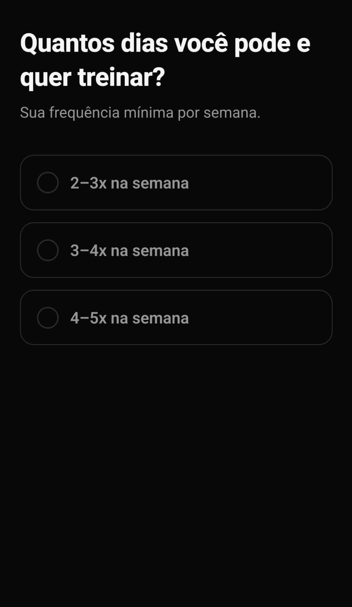
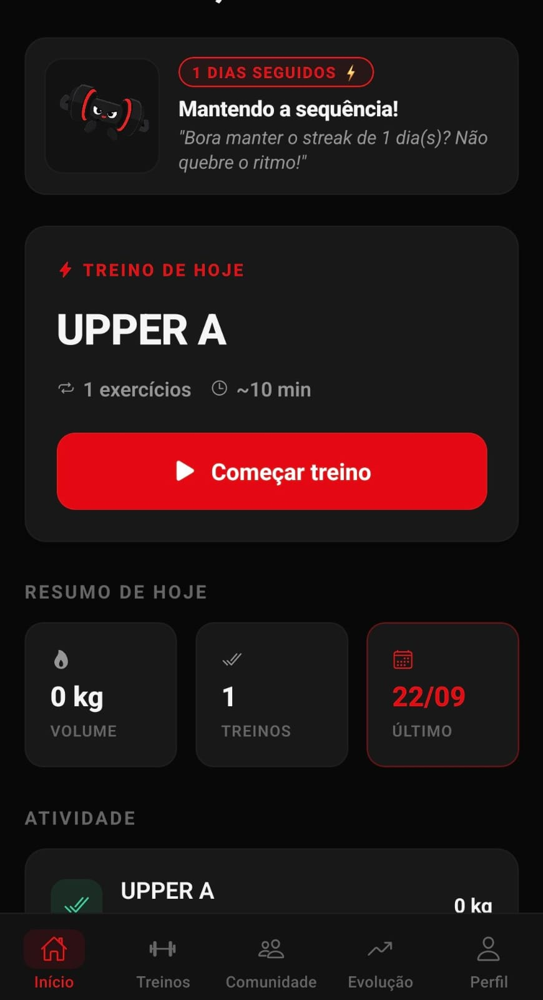
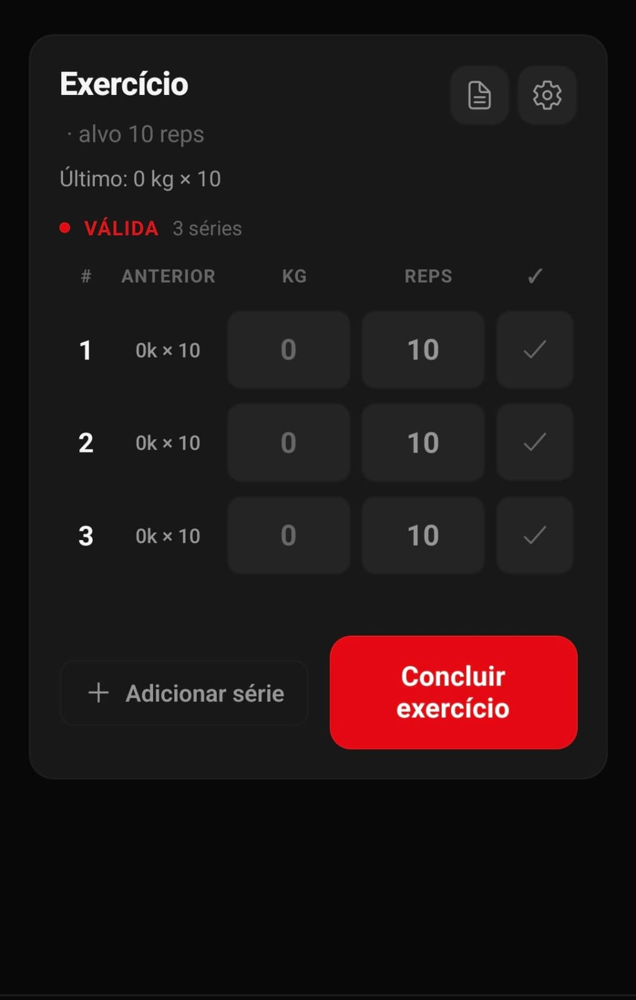
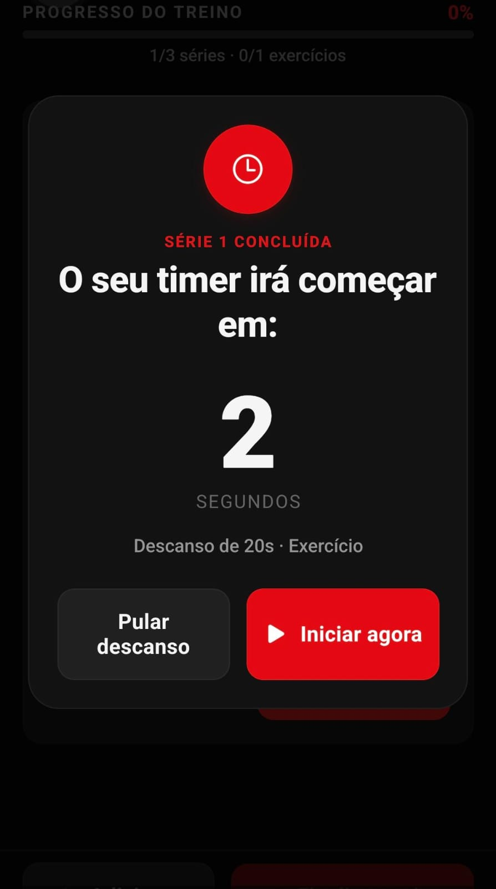
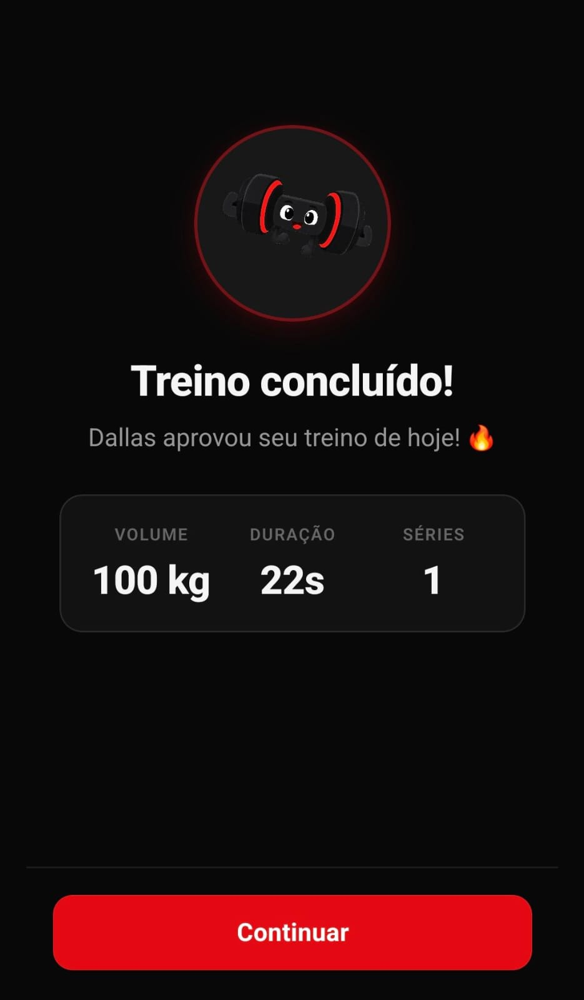
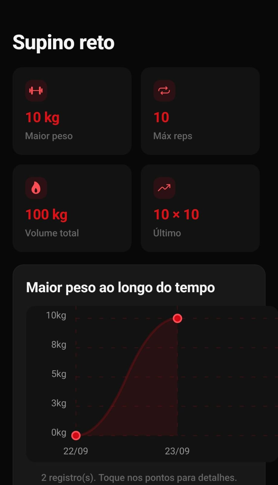

# 🏋️ DALLAS (FitTreino)

> Aplicativo full-stack multiplataforma para gestão de treinos de musculação, acompanhamento de evolução física e engajamento comunitário (grupos, rankings de competição e chat em tempo real).

---

## 📌 1. Sobre o Projeto

O **DALLAS** é uma plataforma desenvolvida para praticantes de musculação e entusiastas fitness que desejam planejar suas rotinas de exercícios, registrar cargas e repetições em tempo real, monitorar sua evolução através de gráficos de desempenho e interagir com amigos através de desafios e grupos competitivos.

### Principais Funcionalidades

- 📋 **Montagem e Gestão de Treinos:** Criação de rotinas personalizadas (Divisões A/B/C/Push-Pull-Legs), com configuração de séries, repetições, carga e intervalos.
- ⏱️ **Execução de Treino com Cronômetro & Feedback Tátil:** Registro de séries concluídas em tempo real, cronômetro de descanso integrado e alertas por vibração (Haptic Feedback).
- 📈 **Métricas e Evolução:** Histórico completo de sessões anteriores e gráficos de progressão de carga por exercício e medidas corporais.
- 👥 **Comunidade & Gamificação:** Criação e participação em grupos, ranking de pontuação em competições e chat integrado entre membros.
- 🔄 **Modo Offline / Cache Local:** O app armazena os dados localmente via AsyncStorage, permitindo consulta de fichas e registro mesmo em academias com sinal de internet instável.

---

## 📱 Telas do Aplicativo (Screenshots)

<div align="center">

### Onboarding e Visão Geral

| Boas-vindas | Metas / Onboarding | Início & Dallas Mascot |
| :---: | :---: | :---: |
|  |  |  |

<br />

### Execução de Treino & Evolução

| Registro de Séries | Timer de Descanso | Treino Concluído | Gráficos de Evolução |
| :---: | :---: | :---: | :---: |
|  |  |  |  |

</div>

---

## 🏗️ 2. Arquitetura do Sistema

O projeto adota uma arquitetura desacoplada dividida em **Frontend Multiplataforma**, **Backend RESTful** e **Banco de Dados Relacional**:

```
                              ┌──────────────────────────────────────┐
                              │     Frontend (Expo SDK 57 / RN)      │
                              │   • Android (APK via EAS Build)      │
                              │   • Web (Vercel) / iOS               │
                              └──────────────────┬───────────────────┘
                                                 │ REST (JSON / Bearer Token)
                                                 ▼
                              ┌──────────────────────────────────────┐
                              │    Backend (Java 17 + Spring Boot 3) │
                              │    Container Docker (Render)         │
                              └──────────────────┬───────────────────┘
                                                 │ JDBC + Connection Pool
                                                 ▼
                              ┌──────────────────────────────────────┐
                              │       PostgreSQL 16 (Supabase)       │
                              └──────────────────────────────────────┘
```

### Tecnologias Utilizadas

#### Frontend (Mobile & Web)
- **Framework:** [React Native](https://reactnative.dev/) (v0.86) com [Expo](https://expo.dev/) (SDK 57).
- **Linguagem:** [TypeScript](https://www.typescriptlang.org/).
- **Navegação:** [React Navigation v7](https://reactnavigation.org/) (Stack Navigation e Bottom Tabs).
- **Persistência Local:** `@react-native-async-storage/async-storage`.
- **Visualização de Dados:** `react-native-chart-kit` e `react-native-svg`.
- **Sensação Tátil e Estilo:** `expo-haptics`, `expo-linear-gradient` e `@expo/vector-icons`.

#### Backend (API REST)
- **Linguagem:** Java 17 (LTS).
- **Framework:** Spring Boot 3.3.4.
- **Persistência e ORM:** Spring Data JPA / Hibernate.
- **Validação:** Jakarta Bean Validation (`spring-boot-starter-validation`).
- **Arquitetura:** Camadas bem definidas (*Controller*, *Service*, *Repository*, *DTO* e *Entity*).

#### Banco de Dados & Infraestrutura
- **Banco de Dados:** PostgreSQL 16 (local via Docker Compose; produção via Supabase / Neon).
- **Containerização:** Docker e Dockerfile multi-stage build.
- **Hospedagem & CI/CD:** Render (API), Vercel (Web) e EAS Build (geração de APKs Android).

---

## 📁 3. Estrutura do Repositório

```text
app-treino/
├── backend/                       # API REST em Spring Boot (Java 17)
│   ├── src/main/java/com/fittreino/
│   │   ├── config/                # Configurações de CORS, Web e Segurança
│   │   ├── controller/            # Endpoints REST (Auth, Workouts, Groups, etc.)
│   │   ├── dto/                   # Objetos de transferência de dados (Request/Response)
│   │   ├── model/                 # Entidades JPA mapeadas no banco de dados
│   │   ├── repository/            # Interfaces de persistência Spring Data JPA
│   │   └── service/               # Regras de negócio da aplicação
│   ├── docker-compose.yml         # Subida do PostgreSQL local
│   ├── Dockerfile                 # Multi-stage build para deploy em nuvem
│   └── pom.xml                    # Dependências e plugins do Maven
│
├── src/                           # Frontend React Native / Expo
│   ├── api/                       # Cliente HTTP (fetch, interceptor, timeout, health check)
│   ├── auth/                      # Contexto de autenticação e sessão do usuário
│   ├── components/                # Componentes reutilizáveis de interface
│   ├── models/                    # Definições de tipos e contratos em TypeScript
│   ├── navigation/                # Navegação por rotas e tabs
│   ├── screens/                   # Telas da aplicação (Home, Treinos, Execução, Grupos, etc.)
│   ├── services/                  # Serviços de frontend e timers de descanso
│   ├── storage/                   # Camada de abstração do AsyncStorage
│   └── theme/                     # Tokens de cores, espaçamentos e suporte a temas
│
├── imgs-git/                      # Capturas de tela para demonstração visual
├── App.tsx                        # Ponto de entrada do React Native
├── app.json                       # Configurações do Expo e EAS Build
├── package.json                   # Dependências e scripts do frontend
└── render.yaml                    # Blueprint de infraestrutura como código (Render)
```

---

## 🚀 4. Como Iniciar o Projeto

### Pré-requisitos

Certifique-se de ter instalado em sua máquina:
- **Node.js** (v18 ou superior) e **npm**
- **Java JDK 17**
- **Docker** e **Docker Compose** (para rodar o banco de dados PostgreSQL localmente)
- Dispositivo móvel com o app **Expo Go** instalado (ou emulador Android/iOS)

---

### Passo 1: Subir o Banco de Dados (PostgreSQL)

Abra um terminal e inicie o container do PostgreSQL usando o Docker Compose:

```bash
cd backend
docker-compose up -d
```

> Isso iniciará o PostgreSQL na porta padrão `5432` com o banco `fittreino`.

---

### Passo 2: Iniciar o Backend (Spring Boot)

Com o banco ativo, execute a API pelo terminal:

```bash
cd backend
./mvnw spring-boot:run
```

A API iniciará na porta **8080**. Você pode testar a conexão acessando:
[http://localhost:8080/api/health](http://localhost:8080/api/health)

---

### Passo 3: Iniciar o Frontend (React Native / Expo)

Em um novo terminal, vá para a raiz do projeto e instale as dependências:

```bash
# Na raiz do projeto (app-treino)
npm install
```

Inicie o servidor de desenvolvimento do Expo:

```bash
npm start
```

No menu interativo do terminal:
- Pressione `a` para rodar no **Emulador Android**.
- Pressione `w` para abrir no **Navegador Web**.
- Ou escaneie o **QR Code** exibido no terminal utilizando o aplicativo **Expo Go** no seu smartphone (conectado na mesma rede Wi-Fi).

> 💡 **Detecção automática de IP:** Em ambiente de desenvolvimento, o aplicativo detecta o IP da sua máquina automaticamente através do Metro bundler para se conectar à API na porta `8080`, sem necessidade de configuração manual de IP.

---

## 📄 Licença

Este projeto é de uso privado e está sob os termos da licença [MIT](file:///home/eduardo/Documentos/app-treino/LICENSE).
